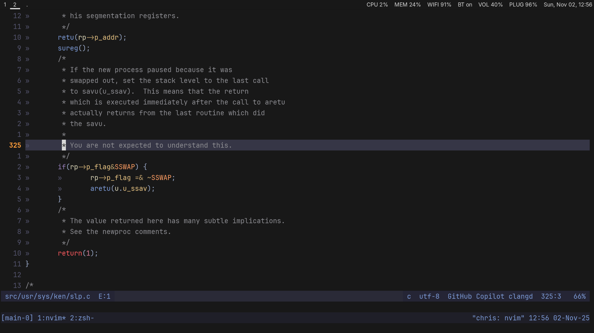

# Dotfiles

Designed to be simple, efficient, performant and stay out of the way. Keyboard and terminal-centric. Unix/Emacs keys in the terminal, Vim keys everywhere else.

## Core Stack

* **Window Manager:** `hyprland` on Arch and `sway` on Debian/Ubuntu, for simplicity and speed on Wayland. Server-like Waybar. Aerospace on MacOS. i3-like keybindings.
* **Shell:** `zsh` with a minimal set of modern efficiency plugins. `fd`, `fzf`, `ripgrep` and `zoxide` integration for fast navigation. Unobtrusive Pure prompt.
* **Terminal:** `ghostty` for GPU-accelerated & Zig speed, Kitty graphics protocol and cross-platform momentum. JetBrains Mono.
* **Multiplexer:** `tmux` for session management. Minimal plugins for save/resume. `C-a` prefix. vi copy mode.
* **Editor:** `nvim` optimized for C, C++, Rust, Go, Python and JS/TS. Recently rebuilt from kickstart and comprehensively extended.\
  (lazy.nvim, mason, telescope, nvim-cmp, nvim-lint, conform, nvim-lspconfig, nvim-dap, neotest, vim-fugitive, gitsigns, some on-demand utils)
* **Extras:** Kanagawa theme. `bat` for paging. `delta` for diffs. `gitui` for operational speed. `kanshi` and `pass` on Linux.



## Installation

To use these dotfiles, clone as a bare repo:

```sh
git clone --bare https://github.com/cosmoconsequent/.dotfiles.git $HOME/.dotfiles
```

Then run the following in tty / terminal emulator:

```sh
alias config='/usr/bin/git --git-dir=$HOME/.dotfiles/ --work-tree=$HOME'
config config --local status.showUntrackedFiles no
```

Then checkout the files for Linux (Arch, Debian/Ubuntu):

```sh
config checkout linux
```

Or MacOS:

```sh
config checkout macos
```
