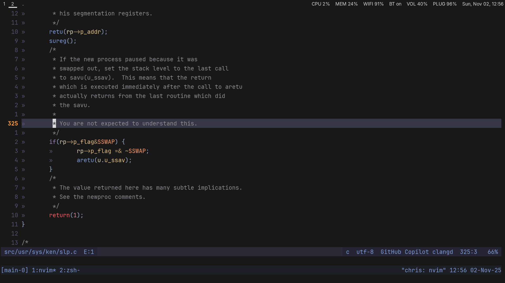

# Dotfiles

Designed to be simple, efficient, performant and stay out of the way. Keyboard and terminal-centric. Unix keys in the terminal, Vim keys everywhere else.

## Core Stack

* **Window Manager:** `hyprland` on Arch and `sway` on Debian/Ubuntu, for simplicity and speed on Wayland. Server-like Waybar. Aerospace on macOS. i3-like keybindings.
* **Shell:** `zsh` with a minimal set of modern efficiency plugins. `fd`, `fzf`, `ripgrep` and `zoxide` integration for fast navigation. Unobtrusive Pure prompt.
* **Terminal:** `ghostty` for GPU-accelerated & Zig speed, Kitty graphics protocol and cross-platform momentum. JetBrains Mono.
* **Multiplexer:** `tmux` for session management. Minimal plugins for save/resume. `C-a` prefix. vi copy mode.
* **Editor:** `nvim` optimized for C, C++, Rust, Go, Python and JS/TS.\
  (lazy.nvim, mason, telescope, nvim-cmp, nvim-lint, conform, nvim-lspconfig, nvim-dap, neotest, vim-fugitive, gitsigns, codecompanion, lazy-loaded utils)
* **Input:** `keyd` on Linux for system-wide modifier normalization, remaps standard and laptop keyboards to match split mechanical thumb cluster ergonomics. Capslock to Esc.
* **Extras:** Kanagawa theme. `bat` for paging. `delta` for diffs. `gitui` for operational speed.



## Editor Toolchain

`nvim` language support is installed via `mason` and wired through `nvim-lspconfig`,
`nvim-lint`, `conform`, `nvim-dap` and `neotest`:

| Language | LSP | Lint | Format | Debug | Test |
| --- | --- | --- | --- | --- | --- |
| Bash | `bashls` | `shellcheck` | `shfmt` | `bash-debug-adapter` | |
| C / C++ | `clangd` | `clang-tidy` | `clang-format` | `codelldb` | `gtest` |
| Rust | `rust_analyzer` | `clippy` | `rustfmt` | `codelldb` | `cargo test` |
| Go | `gopls` | `golangci-lint` | `goimports` | `delve` | `go test` |
| Lua | `lua_ls` | `lua_ls` | `stylua` | | |
| Python | `pyrefly` · `ruff` | `ruff` | `ruff` | `debugpy` | `pytest` |
| JS / TS / JSX / TSX | `tsgo` · `biome` | `biome` | `biome` | `js-debug-adapter` | `jest` |
| HTML | `html` | `html` | `html` | | |
| CSS | `cssls` · `biome` | `biome` | `biome` | | |
| JSON | `jsonls` · `biome` | `biome` | `biome` | | |
| YAML | `yamlls` | `yamllint` | `yamlfmt` | | |
| TOML | `taplo` | `taplo` | `taplo` | | |
| Markdown | `marksman` | `markdownlint-cli2` | `markdownlint-cli2` | | |
| Dockerfile | `dockerls` | `hadolint` | | | |
| XML | | | `xmlformatter` | | |

`clang-tidy`, `clippy` and `shellcheck` run inside their language servers.
HTML formatting falls through to the language server.
CSS and JSON pair spec/schema server with `biome` for lint and format.

## Installation

To use these dotfiles, clone as a bare repo:

```sh
git clone --bare https://github.com/cosmoconsequent/.dotfiles.git $HOME/.dotfiles
```

Then run the following in tty / terminal emulator:

```sh
alias config='git --git-dir=$HOME/.dotfiles/ --work-tree=$HOME'
config config --local status.showUntrackedFiles no
```

Then checkout the files for Linux (Arch, Debian/Ubuntu):

```sh
config checkout linux
```

Or macOS:

```sh
config checkout macos
```
